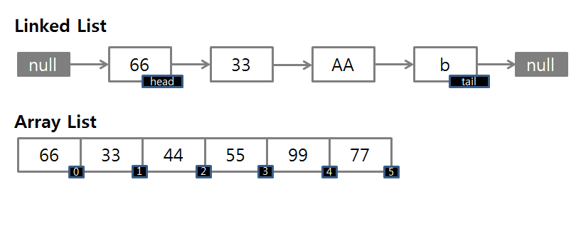
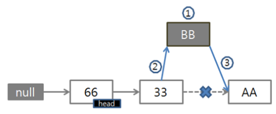
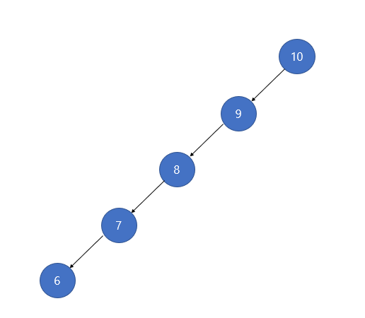
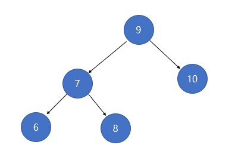
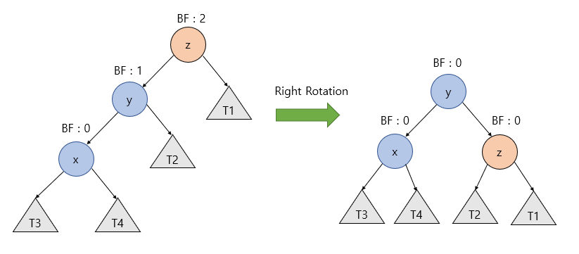
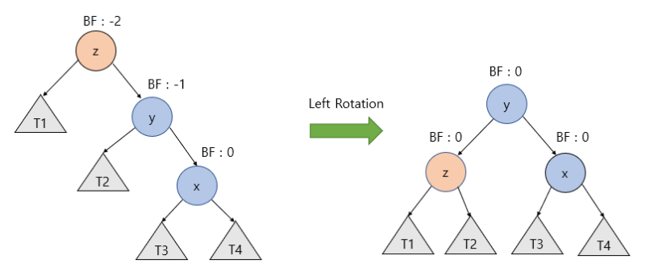
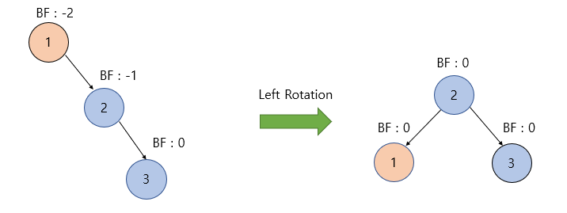

# 1주차(자료구조)

자료구조 : 자료구조는 데이터를 원하는 규칙 또는 목적에 맞게 저장하기 위한 구조

                 → 자료를 처리하는 방법

알고리즘 : 자료구조에 쌓인 데이터를 활용해 어떠한 문제를 해결하기 위한 여러 동작들의 모임

                 → 문제를 처리하는 절차

## ****질문1 : LinkedList와 ArrayList 구조차이를 설명하시오.****

- 답변
    
     ArrayList는 **데이터들이 순서대로 늘어선** 배열의 형식을 취하고 있다.
     LinkedList는 **자료의 주소값으로 서로 연결된 형식**을 가지고 있다. 
    

사진과 같이 ArrayList는 데이터들이 순서대로 늘어선 배열의 형식이다.

                    LinkedList는 자료의 주소값으로 서로 연결된 형식이다.

### 꼬리질문 : ArrayList의 장단점? LinkedList의 장단점?

- 답변
    
    ArrayList는 원하는 데이터에 무작위로 접근할 수 있지만 LinkedList는 무작위 접근이 아닌 순차 접근만 가능하다.
    ArrayList는 데이터 추가/삭제하는데 연산시간이 오래 걸리지만 LinkedList는 가리키는 노드포인터만 바꾸면 되므로 데이터 추가/삭제에 용이하다.
    

**자료조사**

배열의 데이터 추가(삭제도 비슷한 원리)

연결리스트의 데이터 추가(삭제도 비슷한 원리)

- ref
    
    [[기술면접] CS 기술면접 질문 - 자료구조 (2/8)](https://mangkyu.tistory.com/89)
    

## 질문2 : AVL트리에 대해서 설명하시오.

- 답변
    
    AVL 트리란 한 쪽으로 값이 치우치는 이진 탐색 트리(Binary Search Tree, BST)의 한계점을 보완하기 위해 만들어진 균형 잡힌 이진 트리이다. AVL은 항상 좌/우로 데이터를 균형잡힌 상태로 유지하기 위해 추가적인 연산을 진행한다.
    

### AVL 트리란?(Available Tree)

위와 같이 이진탐색트리는 한쪽으로 노드가 쏠리는 한계점이 있다. 10,9,8,7,6을 순서대로 삽입할 시 편향트리가 만들어 지는 것을 알 수 있다.

편향트리의 복잡도 : O(N)

위와 같은 단점을 극복할 수 있는 트리가 AVL트리이다.

위의 편향트리를 AVL트리로 재구성하면 복잡도가 O(logN)이 된다.

**AVL트리의 특성**

이진탐색트리의 속성을 가진다.

왼쪽, 오른쪽 서브 트리의 높이 차이가 **최대 1**이다.

높이 차이가 1보다 커지면 **회전(Rotation)**을 통해 균형을 맞춰 높이 차이를 줄인다.

AVL트리 구성방법 : 좌회전, 우회전

우회전 : y노드의 오른쪽 자식 노드를 z노드로 변경한다.

좌회전 : y노드의 왼쪽 자식 노드를 z노드로 변경한다.

이 좌회전과 우회전을 적절히 사용해서 AVL트리를 구성한다.

LL 케이스 : 우회전 한번 적용

RR 케이스 : 좌회전 한번 적용

LR 케이스 : 좌회전 한번, 우회전 한번 적용

RL 케이스 : 우회전 한번, 좌회전 한번 적용

- ref
    
    [[자료구조] AVL트리란? AVL트리 쉽게 이해하기,  AVL트리 시뮬레이터](https://code-lab1.tistory.com/61)
