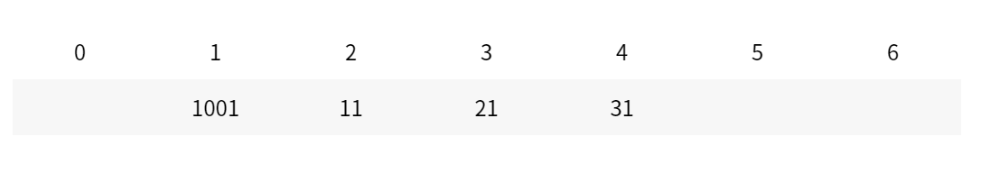
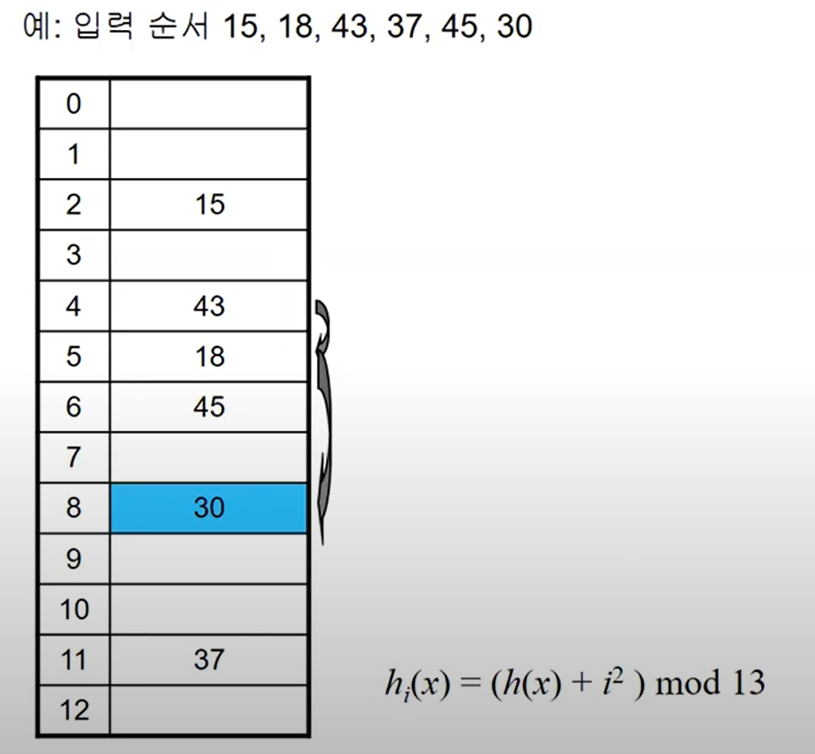
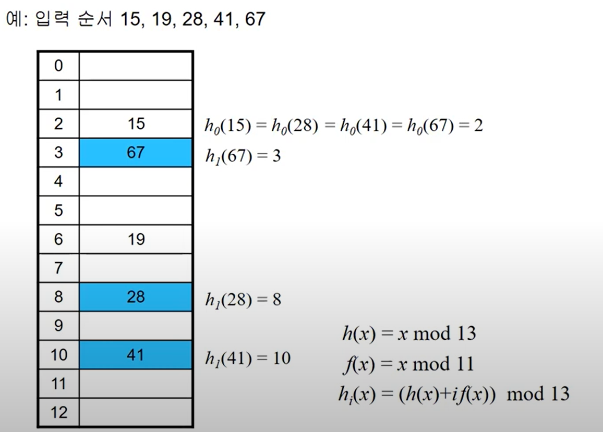

# CS_Study 알고리즘&자료구조(3월 3일)

# 알고리즘

## **Divide and Conquer** 과 ****Dynamic Programming 의 차이점은??****

- 자료조사
    
    정의
    
    **Divide and Conquer (분할 통치법)**
    
    → 문제를 해결하기 쉽도록 먼저 작게 나누고(Divide), 각각의 작은 문제들의 답을 구한 뒤(Conquer), 도출한 답들을 통합(Combine)하여 전체 문제의 해(解)를 찾는 알고리즘.
    
    활용 : merge sort, quick sort과 같은 알고리즘 뿐만 아니라 소프트웨어 공학에서 구조적 분석이나 객체지향 분석과 같은 분야의 바탕이 된다.
    
    **DP (동적 계획법)**
    
    → 큰 문제를 작은 문제로 분할하여 해결한다.
    
    제귀함수(피보나치)를 예시로 하여 설명!!
    
    - DP 추가설명
        
        DP추가 설명
        
        피보나치 수열 함수
        
        ```
        int f(unsignedint n)
        {
        if(n <= 1)
        return 1;
        elsereturn f(n-1)+f(n-2);
        }
        ```
        
        
        
        f(5) 구하는데 15번의 함수호출 → f(100)을 구하는데는 약 7해!!! 번의 함수 호출 → 컴터 죽음 ㅠ
        
        그래서 죽복된 호출을 막는 것이 중요!!
        
- 답변
    
    두 문제 모두 문제의 해결 방식이 큰 문제를 작은 문제로 나누는 방식이라는 점에서 공통점이 있지만 DP의 경우 작은 문제부터 풀고 작은 문제의 솔루션을 저장해 놓았다가 큰 문제에서 작은 문제의 솔루션을 그대로 가져다 쓰는 방식인 것에 반해 D-and-C의 경우 작은 문제를 풀 때 전에 이미 풀었던 문제이더라도 다시 푸는 방식이기 때문에 같은 계산 작업이 많은 문제의 경우 DP가 D-and-C보다 더 유리하다고 할 수 있다. 일반적으로 D-and-C는 위에서부터 아래로 내려오는 Top-down 방식이지만 DP의 경우 Bottom-up방식(Top-down도 가능)이다.
    
- 코드예시
    - top - down
        
        ```
        int memo[100]{};//메모이제이션 공간. 전역 변수이므로 0으로 초기화int fibonacci(unsignedint n)
        {
        if (n<=1)//0번째, 1번째 피보나치 수return n;
        if (memo[n]!=0)//메모가 있는지 확인(0으로 초기화되었으므로 0이 아니라면 메모가 쓰인 것임)return memo[n];//메모 리턴
          memo[n]=fibonacci(n-1) + fibonacci(n-2);//작은 문제로 분할return memo[n];
        }
        ```
        
    - bottom - up
        
        ```
        int f_data[N] = {1, 1};// N은 정의하기 나름int last_pos = 1;// 마지막으로 계산한 지점. 이 코드에선 이미 f_data[1]까지 정의되어있기 때문에 1로 초기화한다.int f(int n)//피보나치 수열의 제 n항을 구한다. 배열의 관점에서는 n-1번째 요소를 구하는 것.
        {
        int i;
        if(f_data[n-1] == 0)// 아직 구한 적이 없으면 구한다
            {
        for(i=last_pos+1; i<n; ++i)
                {
                    f_data[i] = f_data[i-1] + f_data[i-2];
                }
                last_pos = n-1;
            }
        return f_data[n-1];
        }
        ```
        
- Reference
    
    google 시바
    

---

# 자료구조

### 질문 : 해시 테이블에서 Collision발생 시 해결법은???

- 자료조사
    - 해시테이블의 충돌 ? → **같은 거짓값**을 가지는 상황
        
         해시함수의 입력값은 무한하지만, 출력값의 가짓수는 유한(출력값, 즉 키가 유한하지 않다면 해시기법을 사용하는 의미가 없다.)하므로 해시 충돌은 반드시 발생한다.**(비둘기집 원리)**
        
        해시에서는 충돌이 발생 할 수도 있는데 최악의 경우에는 O(N), 일반적으로 잘 구현 된 경우에O(1)의 시간 복잡도를 가지게 됩니다.
        
    - 충돌의 해결방식은 **Chaining, Open addressing** 이 있습니다.
        - **Chaining** : 같은 주소로 해슁되는 원소를 모두 하나의 연결리스트에 매달아 관리하는 방법 입니다.
            - 장점은 연결리스트만 사용하면 되기때문에 복잡한 계산식을 사용할 필요가 개방주소법에 비해 상대적으로 적습니다.
            - 해시테이블이 채워질수록 성능저하가 발생할 가능성이 높습니다.
        - **Open addressing** : 충돌 발생시 다른 버킷에 저장하는 방식입니다
            
             (ex. 선형 탐색, 제곱  탐색, 이중 해싱)
            
    - Open addressing 추가 설명
        - **Linear Probing (선형 탐색)** : 해시 충돌 시 다음 버킷, 혹은 몇개를 건너뛰어 데이터를 삽입하는 방식.
            
            ex) (h(x) + i)  mod m
            
            
            
            1차 군집 현상 발생
            
        - **Quadratic Probing (제곱 탐색)** : 해시 충돌 시 다음 버킷, 혹은 몇개를 건너뛴 버킷에 데이터를 삽입하는 방식.
        
        
        
        → 2차 군집 현상 발생
        
        - **Double Hashing** : 해시 충돌시 다른 해시함수를 한번 더 적용한 결과를 이용하는 방식.
        
        
        
- 답변
    
    대표적인 해결방식에는 출돌이 발생하는 원소들을 하나의 연결리스트로 관리하는 Chaining방식과 충돌 시 다른 버킷에 저장하는 방식인 Open addressing방식이 있는데 Open addressing의 경우 선형 탐색과, 제곱 탐색의 경우 군집현상이 발생하게 되고 이를 해결하기 위해 이중 해싱이라는 방식을 사용한다.
    
- Reference
    
    google
    
- 추가질문
    
    군집현상이 안 좋은 이유??(조유정)
    
    → 군집현상 발생 시, collision현상이 일어나는 범위가 늘어나게 되고 이는 충돌 빈도를 늘리게 되는 악순환이 된다.
