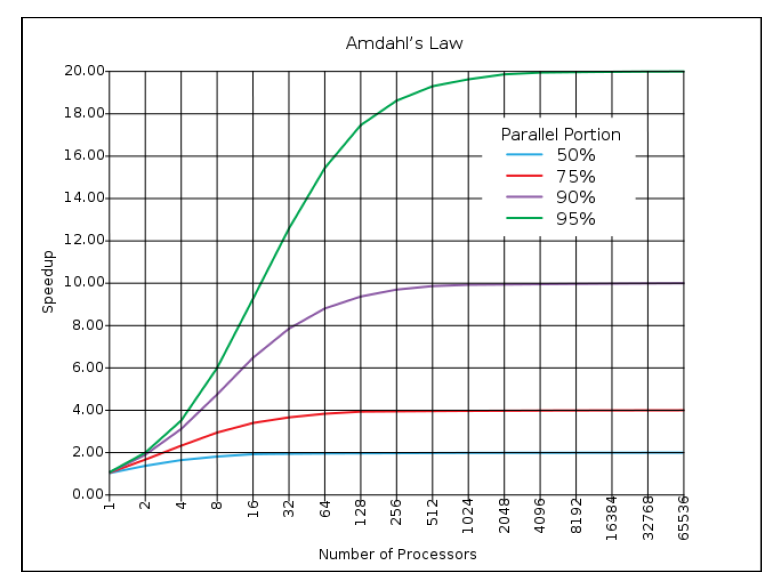
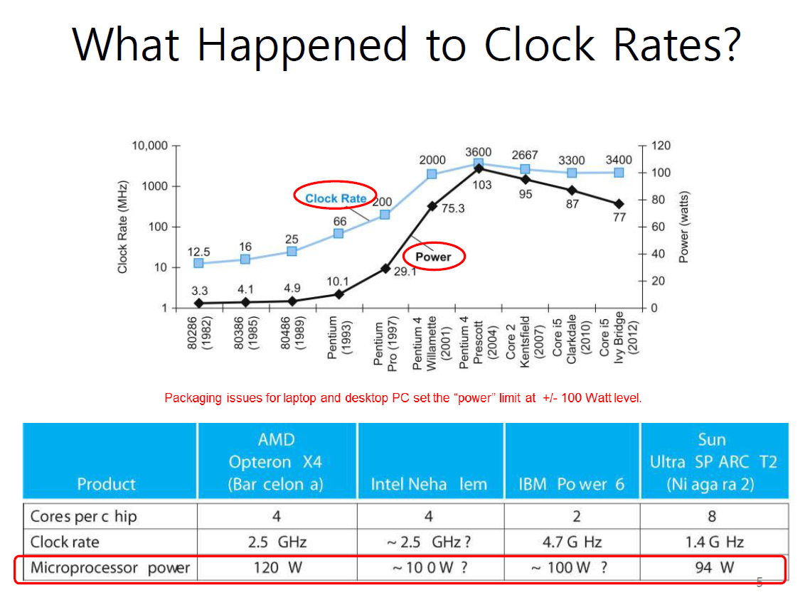
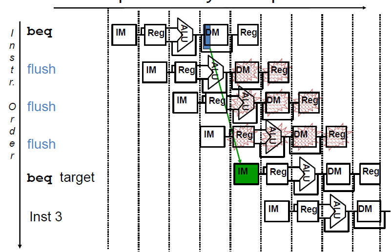
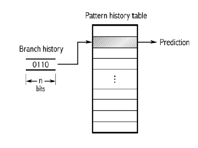

# Parallelism

Reference

- Wikipedia ([parallel computer](https://en.wikipedia.org/wiki/Parallel_computing), [data dependency](https://en.wikipedia.org/wiki/Data_dependency), [memory disambiguation](https://en.wikipedia.org/wiki/Memory_disambiguation))
- Whatls ([speculative execution](https://www.techtarget.com/whatis/definition/speculative-execution#:~:text=Speculative%20execution%20is%20an%20optimization,is%20required%20at%20any%20point.))
- Cornel Univ. Virtual Workshop ([parallel programming concepts](https://cvw.cac.cornell.edu/parallel/depends))
- 곽종욱 교수님 강의 자료(컴구조특론, 클라우드컴퓨팅)

- 자료조사
    - Problems of single-core processor
        
        기존 단일 코어 프로세서 환경에서는 코어의 연산 속도 (clock)만 올리면 성능 향상이 가능하다고 했지만, clock 속도를 올리게 되면 전력 소비가 많아지고 그에 따른 열 발생을 고려하지 않을 수 없음 → 열로 인해 최적의 성능을 발휘하지 못함 (Power wall)
        
        
        
        - transition to multi-core processor
            - 기존 시스템은 단일 코어를 위한 프로그램으로 작성됨
            - 최초 멀티 코어 프로세서의 도입으로 인한 성능 향상은 단일 프로그램이 아닌 동시에 여러 프로그램을 사용할 때 일어났음
            - 병렬 프로그래밍의 도입이 시작됨 → 프로그램의 병렬화
            - 멀티 코어의 도입이 선형적인 성능 향상을 이끌어내진 못함 (amdal’s law)
            
            
            
            - 병렬화할 수 있는 부분이 많을 수록 높은 성능 향상을 이끌어냄
    - Dependency
        - Data Dependency
            - Flow dependency (RAW, true dependency)
                - 같은 변수에 대해 쓰기가 진행된 후 읽기가 발생하는 경우
                - 반복문에서 빈번하게 발생
                - 제거할 수 없는 의존성
                
                ```
                x=y+1
                a=x/2
                x에 대해 RAW가 발생
                ```
                
            - Anti-dependency (WAR)
                - 같은 변수에 대해 읽기가 진행된 후 쓰기가 발생하는 경우
                - 제거 가능한 의존성 (다른 레지스터 활용)
                
                ```
                z=x*2
                x=y+1
                x에 대해 WAR가 발생
                ```
                
            - Output-dependency (WAW)
                - 같은 변수에 대해 쓰기가 진행된 후 쓰기가 발생하는 경우
                - 제거 가능한 의존성 (다른 레지스터 활용)
                
                ```
                x=z*2
                x=y+1
                ```
                
            - Solutions
                - Flow Dependency
                    - value prediction
                    - speculation
                        - 반복문에서 서로 의존성이 없다고 가정하고 병렬적으로 실행하는 과정
                - Anti-dependency & Output-dependency
                    - Register Renaming
        - Control Dependency
            - branch 명령으로 인해 의존성이 발생하는 경우
            
            ```c
            if(a==10)
            	b=10;
            else
            	b=20;
            a=b+10;
            ```
            
            위의 코드의 경우 b에 대한 할당이 if문과의 의존성을 지니게 됨
            
            
            
            branch problem (control dependency)
            
            - Solution
                - branch prediction
                    - speculation
                    - **2-level adaptive branch prediction**
                        
                        분기 명령에 대한 패턴을 기록해 다음 브런치에 대해 예측하는 기술
                        
                        
                        
        - Memory Dependency
            
            포인터가 동일한 주소를 가리키는 경우 발생하는 의존성
            
            - Solutions
                - memory disambiguation
                    - 메모리 의존성을 찾기 위해 프로시저를 확인하는 과정
    - Compiler Optimization
        - Common subexpression elimination
        - Strength reduction
        - Constant folding
        - Constant propagation
        - Handling Loop invariant
        - Loop unrolling
        - Loop fusion
        - Finding Unresearchable code

- amdal’s law의 배경과 그 법칙에 대해 설명해주세요.
    
    전력 문제로 인해 단일 코어 프로세서에서 멀티 코어 프로세서의 도입이 진행됐고 그에 따른 병렬 프로그래밍의 도입이 선형적인 성능향상을 이끌어내지 못한 결과를 낳았습니다. 이에 암달의 법칙은 선형적인 성능향상이 일어나지 못하는 이유를 기술하게 됐고, 병렬화하지 못하는 부분이 많을 수록 그 성능 향상의 정도가 떨어진다는 걸 보여줬습니다.
    
- 데이터 의존성의 종류와 그 해결방안에 대해 설명해주세요
    
    데이터 의존성은 flow dependency, anti-dependency, output-dependency 가 있으며, 각각 RAW, WAR, WAW로 인해 발생하게 됩니다. 읽기와 쓰기의 순서로 인해 의존성이 발생하게 되고 WAR과 WAW의 경우는 register renaming을 통해 다른 레지스터를 활용해 이를 해결할 수 있지만, RAW의 경우 쓰기로 인해 변경된 값이 값을 읽을 때 영향을 끼치므로 완전히 해결할 수 는 없지만, value prediction과 speculation과 같은 예측 기술을 통해 성능 저하를 방지할 수 있습니다.