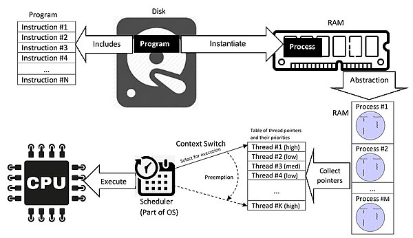

# CS_Study_example

## 프로세스와 스레드의 차이점에 대해 설명해주세요

- 자료 조사
    
    
    
    - 프로그램(program)
        - 컴퓨터가 실행하기 위한 프로그래밍 언어로 작성된 명령어들의 집합 또는 순서
        - 사람이 읽을 수 있는 형태의 프로그램 - source code
            - 이는 추가적인 컴퓨터 프로그램을 요구함
            - 컴퓨터가 각자의 기계어로만 실행할 수 있기때문
            - 이는 해당 언어의 컴파일러를 통해 executable 파일로 변환
            - 어셈블리 언어는 어셈블러를 통해 변환
            - 언어의 인터프리터를 통한 실행도 가능

            
    - 프로세스(process)
        - 하나 또는 그 이상의 스레드에 의해 실행되는 컴퓨터 프로그램
        - 이는 운영체제에 따라 다른 형태를 가짐
        - 프로그램 코드, 할당 자원, 물리/논리적 접근 권한, 데이터 구조, 제어, 관련 실행 활동으로 구성됨
        - 운영체제에 따라  여러 스레드로 구성되며, 이는 동시적으로 명령어를 실행할 수 있게 함


    - 스레드(thread)
        - 스레드는 프로그램을 실행할 수 있는 가장 작은 단위로 각각 스케쥴러에 의해 독립적으로 관리될 수 있다.
        - 한 프로세스에 의해 생성된 여러 스레드들은 서로 자원을 공유할 수 있으며, 동시 실행이 가능하다.


    - 스케쥴러(scheduler)
        - 스케쥴러는 작업을 실행하기 위해 자원의 할당과 회수를 진행하는 활동(스케쥴링)을 담당함.
        - 작업의 단위는 스레드, 프로세스, 데이터 플로우가 될 수 있음.
        - 이는 멀티 태스킹을 활용할 수 있도록 하며, 컴퓨팅 자원의 활용성을 높이기 위함이다.
        - 이 과정에서 우선순위가 높은 작업에 먼저 자원을 할당(preemption, 선점형)하거나, 기존의 작업과 다른 작업을 교체(Context Switch)를 진행


        - 스케쥴링 알고리즘
            - FIFO(First-In First-Out)
                - 먼저 온 작업 먼저 처리
            - EDF(Earliest Deadline First)
                - 데드라인이 가장 먼저인 작업에 우선순위
            - SJF(Shortest Job First)
                - 남은 시간이 가장 짧은 작업에 우선순위
            - FPPS(Fixed Priority Pre-emptive Scheduling)
                - 프로세스에 대해 고정된 우선순위 부여
                - 낮은 우선순위의 작업에 starvation 발생 가능
            - RR(Round-Robin)
                - 작업의 특성을 고려하지 않고 고정된 시간만큼만 작업을 할당
            - Multilevel queue
                - 작업의 성격을 그룹별로 나눌 수 있을 때 활용
                - foreground process(interactive) vs. background process(batch)


- 답안
    
    프로세스와 스레드는 모두 CPU가 처리할 수 있는 하나의 작업 단위가 될 수 있지만, 프로세스는 서로 간의 메모리 자원을 공유할 수 없지만, 스레드는 이를 공유할 수 있다는 점에서 차이점이 있습니다. 스레드의 이런 특징은 프로그래머 레벨에서 동시 프로그래밍, 멀티 프로그래밍을 가능하게 해줍니다. 
    
- 코드 예시
    
    전체 합(1~100)
    
    싱글 프로그래밍
    
    ```cpp
    #include <iostream>
    #include <chrono>
    
    using namespace std;
    using namespace chrono;
    
    int sum=0;
    
    void partSum(int start, int end)
    {
        for(int i =start; i <=end;i++)
        {
                sum+=i;
                //cout<<"partial : "<< sum <<"("<<i<<")"<<endl;
        }
    }
    
    int main(){
        auto begin = steady_clock::now();
    
        partSum(1,100);
    
        auto end = steady_clock::now();
    
        cout<<"sum : "<< sum << endl;
        cout<<"runtime : "<<duration_cast<nanoseconds>(end-begin).count()<<"ns"<<endl;
        return 0;
    }
    ```
    
    병렬 프로그래밍 (4-thread)
    
    ```cpp
    #include <iostream>
    #include <thread>
    #include <chrono>
    
    using namespace std;
    using namespace chrono;
    int sum = 0;
    
    void partSum(int start, int end)
    {
        for(int i =start; i <=end;i++)
        {
                sum+=i;
                //cout<<"partial : "<< sum <<"("<<i<<")"<<endl;
        }
    }
    
    int main()
    {
        thread thread1(partSum,1,25);
        thread thread2(partSum,26,50);
        thread thread3(partSum,51,75);
        thread thread4(partSum,76,100);
    
        auto begin = steady_clock::now();
        thread1.join();
        thread2.join();
        thread3.join();
        thread4.join();
    
        auto end = steady_clock::now();
        cout<<"sum : "<< sum << endl;
        cout<<"runtime : "<<duration_cast<nanoseconds>(end-begin).count()<<"ns"<<endl;
        return 0;
    
    }
    ```
    
- Reference
    
    Wikipedia ([Process](https://en.wikipedia.org/wiki/Process_(computing)), [Light-weight process](https://en.wikipedia.org/wiki/Light-weight_process), [Thread](https://en.wikipedia.org/wiki/Thread_(computing)))
